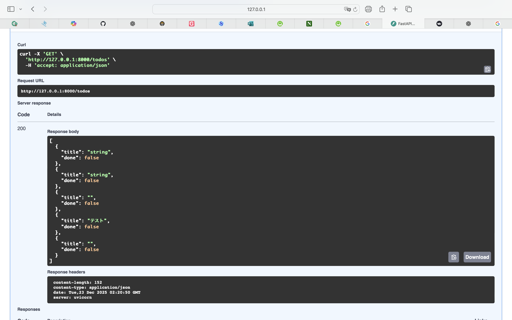
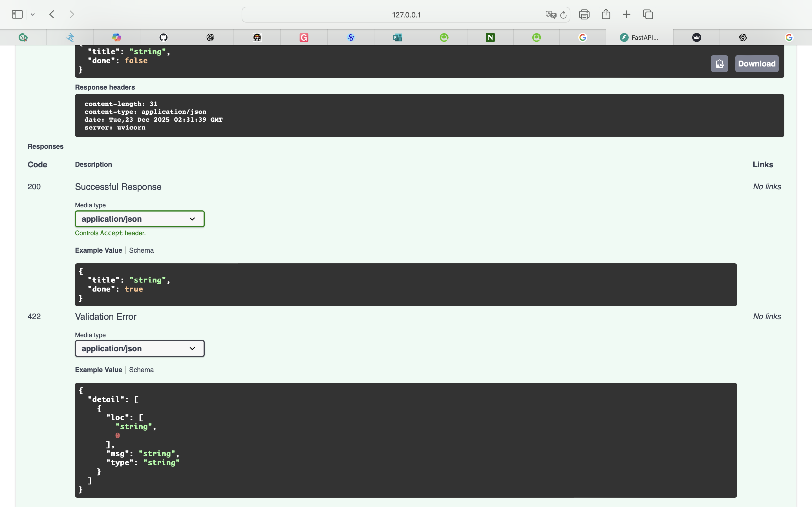
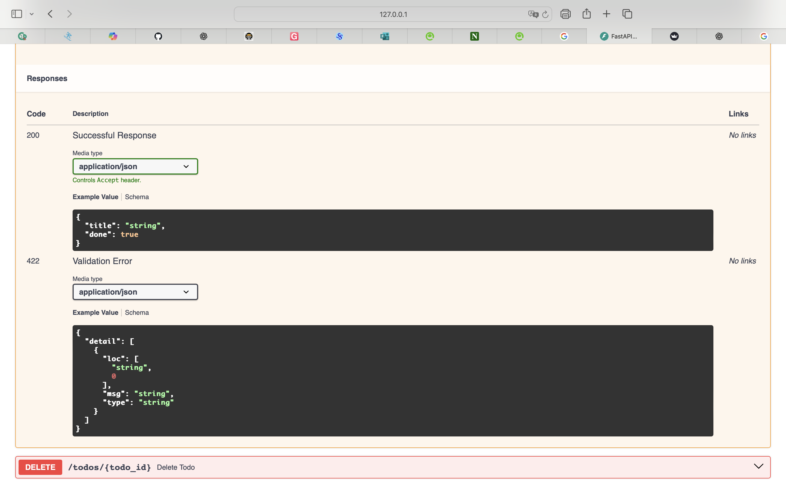
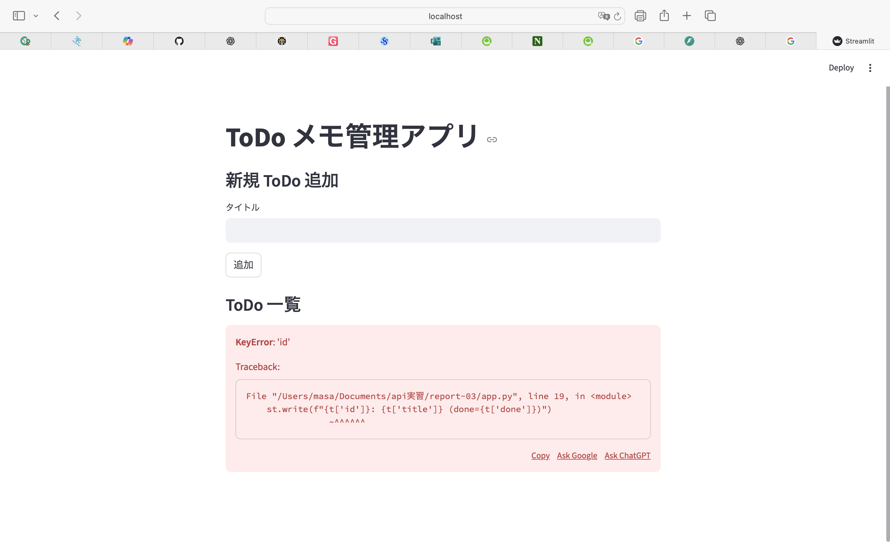
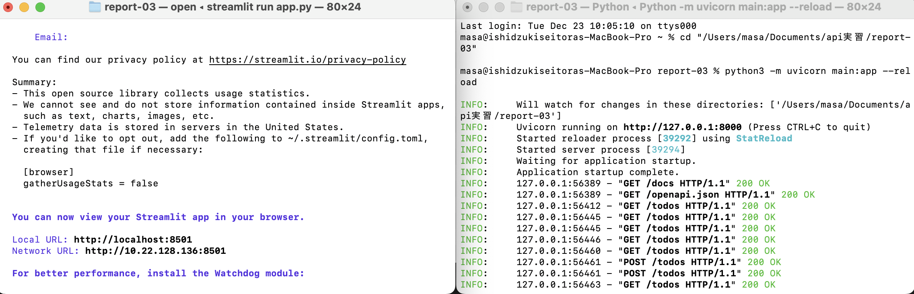

# 回答用紙 （学生用）

(本Markdownファイルを記入し、課題を完成、提出すること)

##  API実習　2025　課題レポート（第3回）

**API 実習課題**: FastAPI + Streamlit + OpenAPIドキュメントの「設計」「実装」「動作確認」

###  出題範囲：　API実習2025　第7回～第9回まで

###  提出期限：　2025/12/23(火) 17:00

-------

レポート提出者：

|クラス|学籍番号|　氏名　|
|-|-|-|
| B| 20123003|  石附政寅 |


# 　**ToDo メモ管理 API 実習レポート（FastAPI / Streamlit）**

## 1. 実習の目的

（※ APIとは何か？今回の授業で学ぶことを100～200字程度で記述）

> **記入欄：**
APIとは、アプリケーション同士が決められた形式で情報をやり取りするための接続口である。特定のURLにリクエストを送ると、サーバがデータや処理結果を返す仕組みで、アプリ間の連携や自動化を安全かつ効率的に行うために使われ流。
---

## 2. API 設計（エンドポイント仕様）

| メソッド   | パス      | 内容 | リクエスト例 | レスポンス例 |
| ------ | ----------- | -- | ------ | ------ |
| GET    | /todos      | ToDo一覧取得   |    なし    |    json\n[{"id":1,"title":"買い物","done":false}]\n   |
| POST   | /todos      |   新規追加 |   json\n{"title":"掃除"}\n     |   json\n{"id":2,"title":"掃除","done":false}\n     |
| PUT    | /todos/{id} |  更新  | json\n{"title":"掃除（完了）","done":true}\n   |json\n{"id":2,"title":"掃除（完了）","done":true}\n   |
| DELETE | /todos/{id} |  削除  |  なし     |   json\n{"message":"deleted"}\n    |

> ※ 例を JSON 形式で記載
> **記入欄：**
 メソッド   | パス      | 内容 | リクエスト例 | レスポンス例 |
| ------ | ----------- | -- | ------ | ------ |
| GET    | /todos      | ToDo一覧取得   |    なし    |    json\n[{"id":1,"title":"買い物","done":false}]\n   |
| POST   | /todos      |   新規追加 |   json\n{"title":"掃除"}\n     |   json\n{"id":2,"title":"掃除","done":false}\n     |
| PUT    | /todos/{id} |  更新  | json\n{"title":"掃除（完了）","done":true}\n   |json\n{"id":2,"title":"掃除（完了）","done":true}\n   |
| DELETE | /todos/{id} |  削除  |  なし     |   json\n{"message":"deleted"}\n    |


## 3. 使用した技術構成（選択した項目に ✓）

| 使用技術            |  使用 | 備考（任意） |
| --------------- | :-: | ------ |
| FastAPI         | [✔️ ] |    API サーバを構築    |
| Streamlit       | [✔️ ] |    UI から API を操作    |
| SQLite（DB 永続化）  | ✔️ [ ] |    ToDo データの永続化   |
| SQLAlchemy（ORM） | [ ✔️ ] |    ORM による DB 操作    |
| そのほか            | [ ] |        |

> ※ SQLite / SQLAlchemy を使用した場合は後半の加点欄も記入

---

## 4. FastAPI コード（主要部分のみ抜粋）

（※ スクリーンショット不可。**テキストで貼り付ける**）

```python
# FastAPI の主要コードをここに貼る
from fastapi import FastAPI, HTTPException
from pydantic import BaseModel
from typing import List
from database import SessionLocal, Todo

app = FastAPI()

class TodoCreate(BaseModel):
    title: str

class TodoUpdate(BaseModel):
    title: str
    done: bool

@app.get("/todos", response_model=List[TodoUpdate])
def get_todos():
    db = SessionLocal()
    return db.query(Todo).all()

@app.post("/todos", response_model=TodoUpdate)
def create_todo(todo: TodoCreate):
    db = SessionLocal()
    new_todo = Todo(title=todo.title, done=False)
    db.add(new_todo)
    db.commit()
    db.refresh(new_todo)
    return new_todo

@app.put("/todos/{todo_id}", response_model=TodoUpdate)
def update_todo(todo_id: int, todo: TodoUpdate):
    db = SessionLocal()
    target = db.query(Todo).filter(Todo.id == todo_id).first()
    if not target:
        raise HTTPException(status_code=404, detail="Not found")
    target.title = todo.title
    target.done = todo.done
    db.commit()
    return target

@app.delete("/todos/{todo_id}")
def delete_todo(todo_id: int):
    db = SessionLocal()
    target = db.query(Todo).filter(Todo.id == todo_id).first()
    if not target:
        raise HTTPException(status_code=404, detail="Not found")
    db.delete(target)
    db.commit()
    return {"message": "deleted"}

```

---

## 5. OpenAPI ドキュメント動作確認（スクリーンショット貼付）

| 操作         | 貼付欄 |
| ---------- | --- |
| POST（新規追加） |   |
| GET（一覧取得）  |   |
| PUT（更新）    |   |
| DELETE（削除） |    |


---

## 6. Streamlit 画面 UI（スクリーンショット貼付）

| 画面キャプチャ       | 貼付欄 |
| ------------- | --- |
| 実行画面          |     |
| 操作例（追加・更新・削除） |     |

---

## 7. API 通信ログ（サーバログ or Web通信キャプチャなど）

サーバーコンソールやログ画面のキャプチャを 1 枚以上添付

| ログ例（貼付欄） |
| -------- |
|       |

---

## 8. 学習したこと・感想（100文字以上）

> **記入欄：**
FastAPI を使うことで、少ないコード量で高速な API を構築できることを学んだ。また、OpenAPI ドキュメントを通して API の動作を視覚的に確認でき、設計と実装の関係を理解しやすかった。さらに Streamlit を組み合わせることで、バックエンドとフロントエンドの連携を体験でき、Web アプリ全体の流れを実感できた。今回の実習を通して、API 開発の基礎と実践的なワークフローを身につけることができた。

## チャレンジ課題：  9. SQLite / SQLAlchemy 導入内容

（使用した人のみ記述）

### 9-1. ER図（例：テーブル）

```
# 具体例を書いたり、手書きを撮影して貼っても良い
+----------------------+
|       Todo           |
+----------------------+
| id    : INTEGER PK   |
| title : TEXT         |
| done  : BOOLEAN       |
+----------------------+

```

### 9-2. DB を使うメリット

> **記入欄：**
SQLite を使用することで、ToDo データをファイルとして永続的に保存でき、アプリを再起動しても情報が失われない点が大きなメリットである。また、複数のデータを効率的に検索・更新でき、データ構造が増えても安定して管理できる。さらに、SQL による厳密なデータ管理が可能になり、アプリの信頼性と拡張性が向上する。
### 9-3. SQLAlchemy を使用した理由

> **記入欄：**
SQLAlchemy を使用することで、SQL 文を直接書かずに Python のクラスとしてデータベースを扱えるため、コードの可読性と保守性が向上する。また、ORM によりデータベースの種類に依存しない実装が可能となり、将来的に SQLite から MySQL や PostgreSQL へ移行する際も変更が最小限で済むため。

## 10. 参考資料（使用した場合のみ記入）

| 種類     | URL / 書籍名 |
| ------ | --------- |
| Webサイト |     SQLAlchemy 公式ドキュメント（https://www.sqlalchemy.org/）      |
| 書籍     |           |
| その他    |           |

**提出前チェックリスト**

* [ ✔️] API のコードを貼った
* [✔️ ] OpenAPI のスクリーンショットを貼った
* [✔️ ] Streamlit UI の画像を貼った
* [ ✔️] 学習したことを 100 字以上書いた
* [ ✔️] SQLite / SQLAlchemy の加点欄（使った場合のみ）

